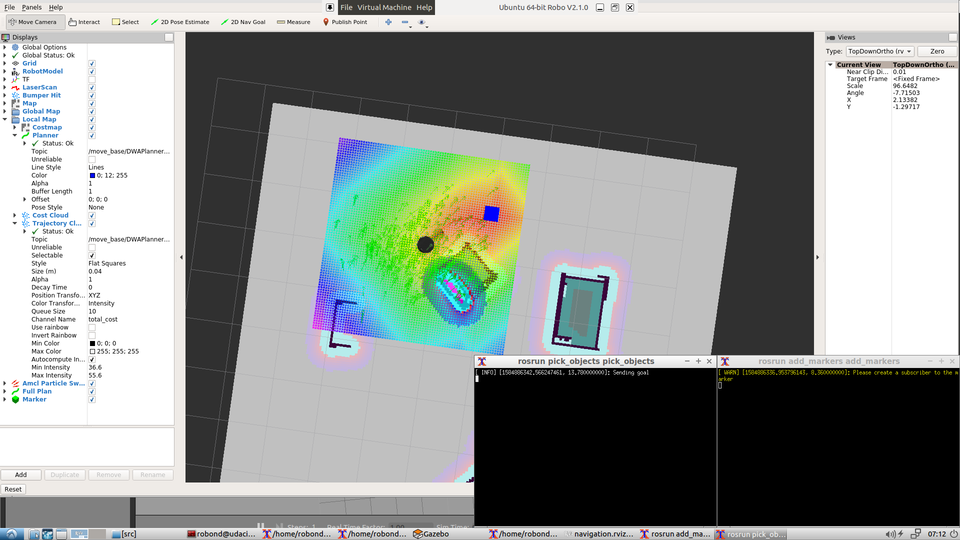

# catkin_service_robot
Home delivery service robot that can autonomously map an environment with gmapping and navigate to pick up and dropped virtual objects(simulate) using navigation stack, code in `src/pick_objects/src/pick_objects.cpp`. Deploy the virtual markers in `add_markers/src/add_markers.cpp`.

## Configuration requires
- A 2D Laser, providing sensor_msgs/LaserScan messages
- Odometry sensors, providing nav_msgs/Odometry messages

## Requirment
- Ubuntu or Lubuntu
- ROS kinetic;
- Gazebo 7.16.0
- Rviz 
- Xterm, intall it with `sudo apt-get install xterm`

## Usage
0. Upgrade the system `sudo apt-get update && apt-get upgrade`
1. `cd /path/to/catkin_service_robot`:
2. `git clone https://github.com/ros-perception/slam_gmapping.git src/slam_gmapping`
3. `git clone https://github.com/turtlebot/turtlebot_interactions.git src/turtlebot_interactions`
4. `git clone https://github.com/turtlebot/turtlebot_simulator.git src/turtlebot_simulator`
5. `git clone https://github.com/turtlebot/turtlebot.git src/turtlebot`
6. Compile project with `catkin_make`
7. `source devel/setup.bash`
8. Run the .sh file `sh src/scripts/home_service.sh`, it will launch separate instances of terminal to run each launch file, so you can track output of different nodes.
